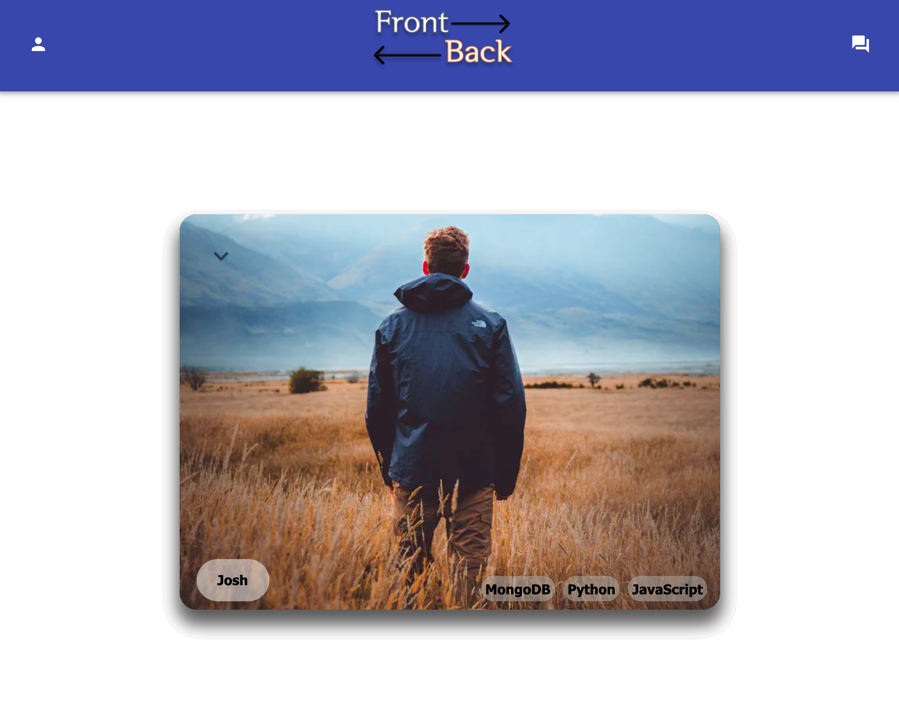

# Front to Back

## Description

_Duration: 2 Week Sprint_

Front to Back provides a social platform solution for software developers looking for help working on side-projects.  The reality is we can’t be good at everything, sometimes it would be nice to allow an expert to do what they do best.  If backend coding isn’t your forte, let Front to Back help connect you with a backend developer.  If frontend isn’t your style, use Front to Back to find a frontend developer to make your side project a reality.

Front to Back was developed in a 2 week Sprint.  The first 3 days were spent scoping the project.  The rest of the time was spent building and testing for bugs.

To see the fully functional site, please visit: [Front to Back](Coming soon hosted on heroku)

## Screen Shot

## Prerequisites

Before you get started, make sure you have the following software installed on your computer:

- [Node.js](https://nodejs.org/en/)
- [PostrgeSQL](https://www.postgresql.org/)
- [Nodemon](https://nodemon.io/)

## Installation

1. Create a database named `front_to_back`,
2. The queries in the `database.sql` file are set up to create all the necessary tables and populate the needed data to allow the application to run correctly. The project is built on [Postgres](https://www.postgresql.org/download/). I recommend using Postico as the GUI for easy database access. 
3. Open up your editor of choice and run an `npm install`
4. Run `npm run server` in your terminal
5. Run `npm run client` in your terminal
6. The `npm run client` command will open up a new browser tab for you!

## Usage
How to use Front to Back.

1. The user logs in or registers for an account on the landing page and proceeds to fill out their profile information.
2. Once the profile info is submitted, the user will be be brought to the home page. The user will see a stack of profiles that he/she can swipe either right (to send connection request) or left to (pass on that profile and send it to the end of the stack).
3. The user may click on the arrow icon button on the profile card to see further profile details.
4. The user may click on the message icon in the header to go to the connection page.  Here the user will see all pending connection requests.  The user will be able to accept or decline the connection request after view the profile details.
5. If the user accepts the connection request, a chat icon will appear next to that user profile.  The user can click on the chat icon to start chatting with the new connection.  If the decline button is clicked, the connection request will be removed and that user will go back into the profile stack incase you change your mind at a later point.
6. The profile icon in the header will take the user to the edit profile page.  Here the user may view their profile information, and make changes as necessary.

## Built With

This application uses the following technologies:

- [React](https://reactjs.org/)
- [Redux](https://maven.apache.org/)
- [Redux-Sagas](https://redux-saga.js.org/)
- [Express](https://expressjs.com/)
- [PostgreSQL](https://www.postgresql.org/)
- [Material-UI](https://material-ui.com/)

(a full list of dependencies can be found in `package.json`)

## Acknowledgement
Thanks to all of the staff at [Prime Digital Academy](https://www.primeacademy.io) who equipped me with the skills to make this application a reality, especially my instructors Dev, Janna, and Dane Smith. Thank you to the EMIRP Cohort for the all of the collaboration throughout our group projects during the course.

## Support
If you have suggestions or issues, please email me at gabinwilliams@gmail.com or find me at https://www.linkedin.com/in/gabin-williams/

